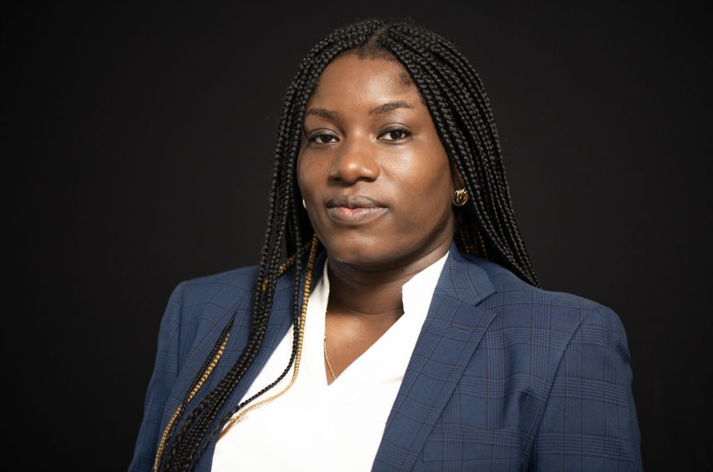

### (Housing, houisng policy, race and ethnicity, poverty and income, GIS Methods)

My name is Angela Jones-Orokoh. I am a rising 3rd year PhD student at the University of Chicago Crown School of Social Work, Policy, and Practice. I study racial, economic, and spatial inequality, particularly in the context of housing, neighborhood change, and public policy. My research, which takes a transdisciplinary approach and utilizes quantitative, computational, and historic-comparative methods, is aimed at investigating the multifactorial conditions of housing. In my current research, I focus on African American applied heuristics of the ‘right to the city’ within the United States and the spatial expressions and productions of self-determination within the urban context. 

